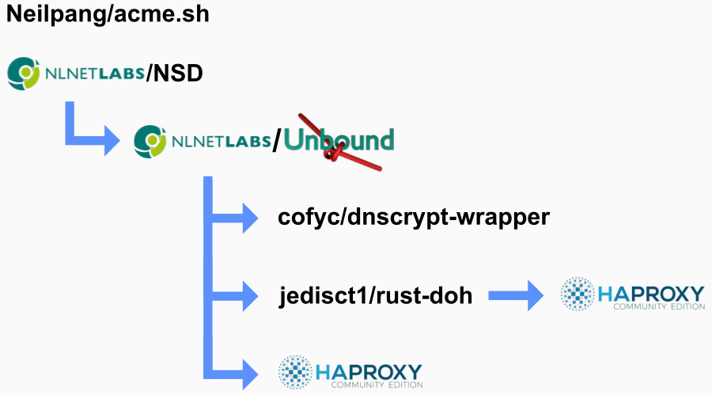

    

# DNS Resolver Infrastructure

## Infrastructure Overview

 

    

* [acme.sh](https://github.com/Neilpang/acme.sh) (TLS certificate generation for haproxy)
* [nsd](https://www.nlnetlabs.nl/projects/nsd/) ([OpenNIC](https://www.opennic.org/))
  * [unbound](https://unbound.nlnetlabs.nl/) (DNS Resolver)
    * [dnscrypt-wrapper](https://github.com/cofyc/dnscrypt-wrapper) (dnscrypt)
    * [doh-proxy](https://github.com/jedisct1/rust-doh)
      * [haproxy](http://www.haproxy.org/) (DHS-over-HTTPS)
    * [haproxy](http://www.haproxy.org/) (DNS-over-TLS)

## Getting started

* [Usage with Docker-Swarm](docker.md)
* [Usage with Kubernetes](kube.md)
